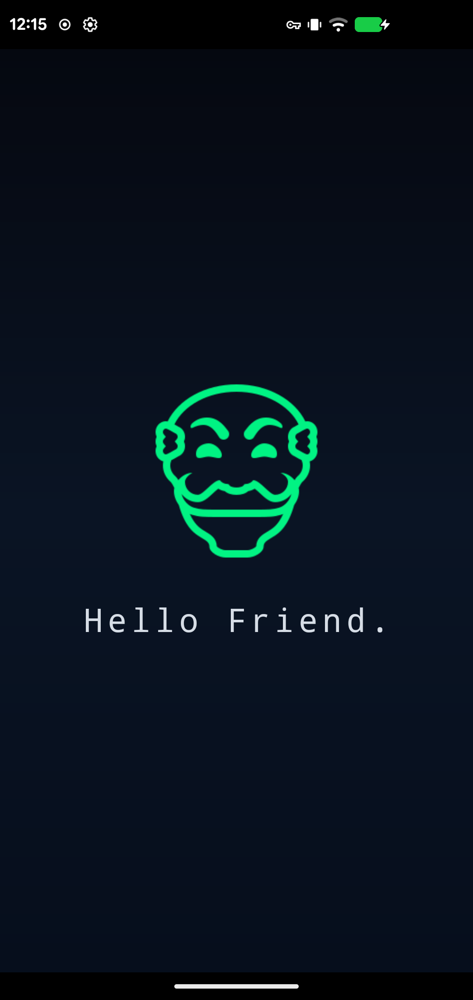
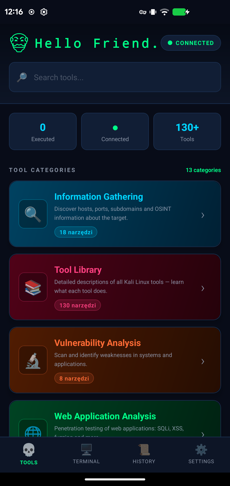
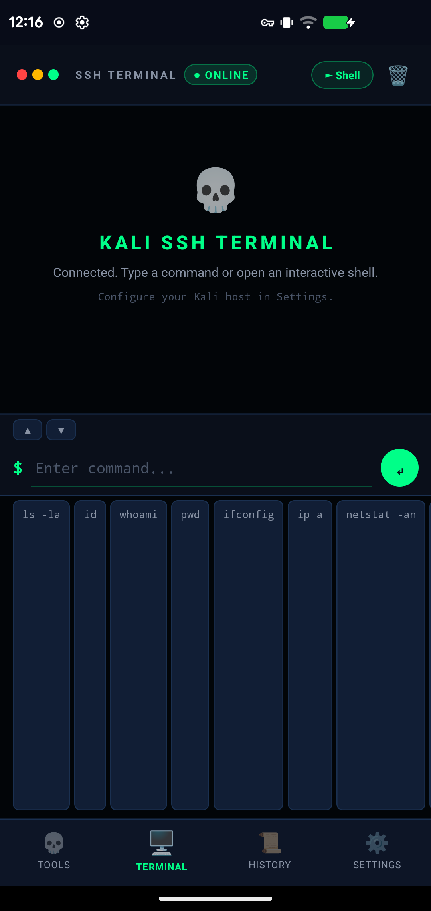
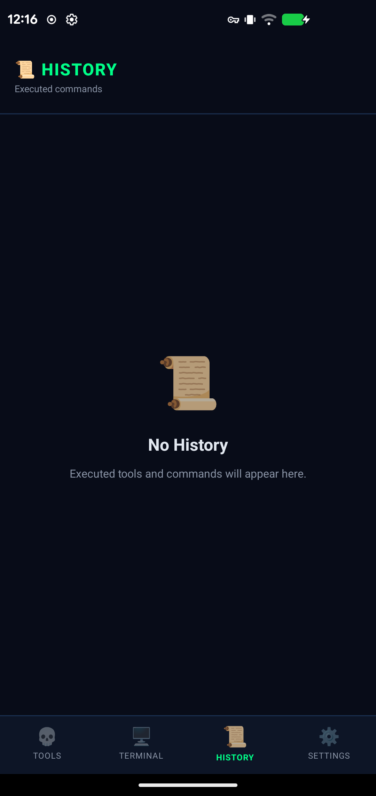
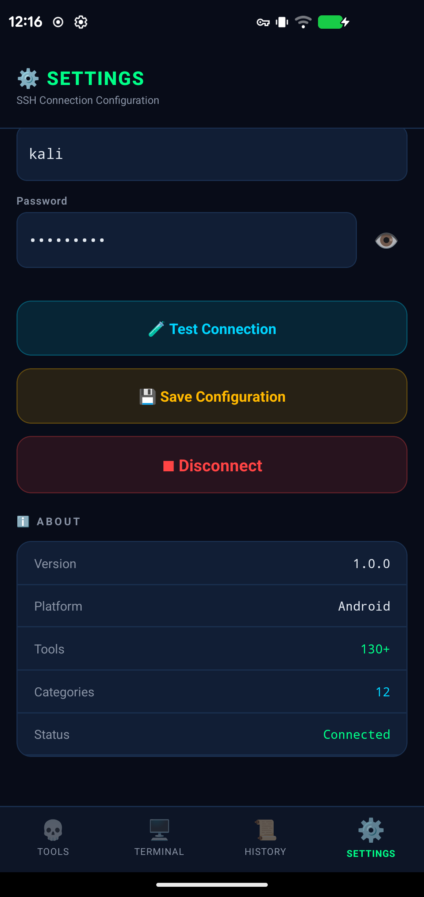
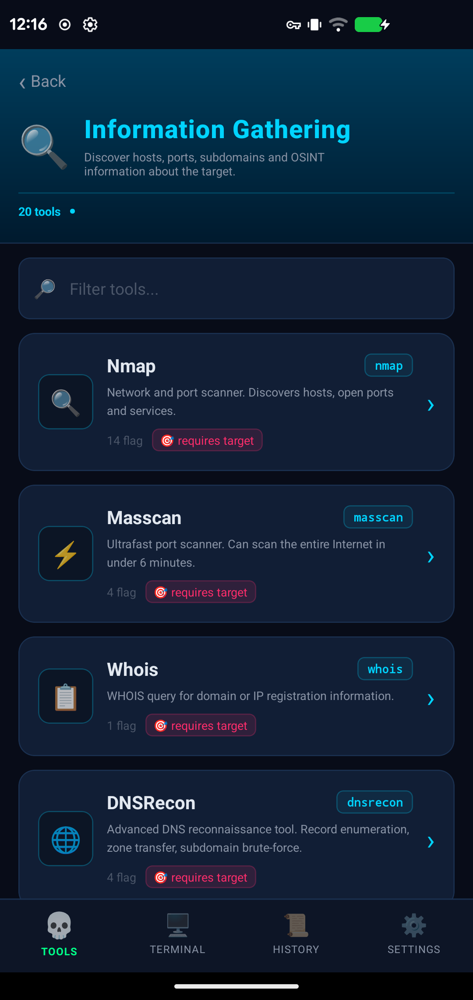
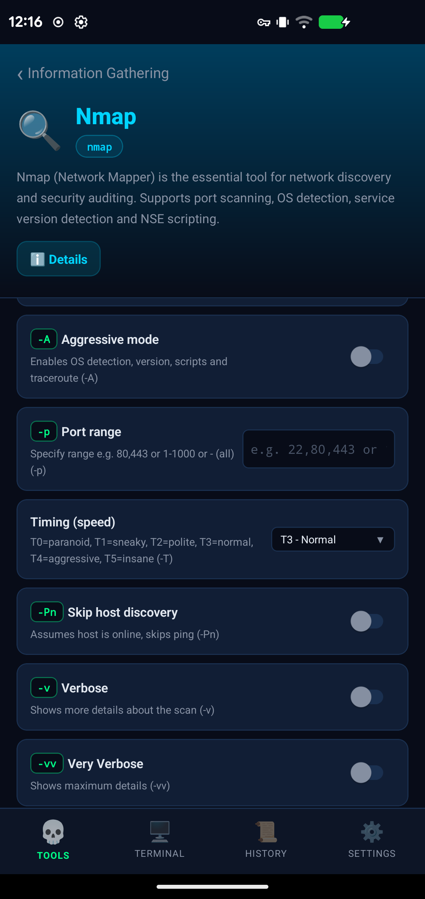
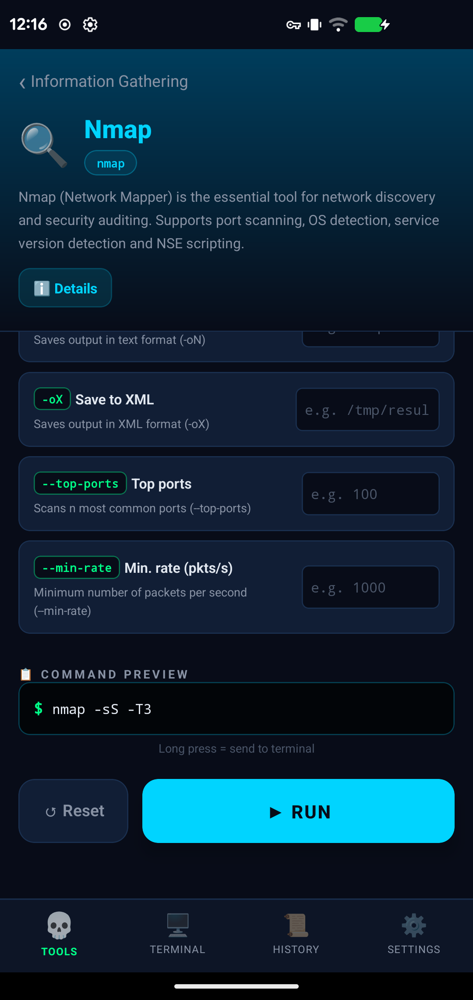

# Kali Remote GUI

> **Professional mobile interface for Kali Linux penetration testing tools**

[](https://opensource.org/licenses/MIT)
[](https://reactnative.dev/)
[](#security-warning)

Transform your Android device into a powerful remote terminal for Kali Linux. Execute 130+ penetration testing tools, monitor real-time output, and manage multiple sessions — all through an intuitive mobile interface.

**[Download Latest Release](https://github.com/notconnector/kali-remote-gui/releases)** | **[Full Setup Guide](SETUP.md)** | **[Contributing](CONTRIBUTING.md)**

---

## ⚠️ **SECURITY WARNING**

<div style="border: 3px solid #dc3545; padding: 15px; margin: 20px 0; border-radius: 5px; background-color: #f8d7da;">
  <strong style="color: #721c24; font-size: 18px;">🔒 CRITICAL: Full System Access</strong><br><br>
  The <code>shell_start</code> mode provides <strong>unrestricted, full access</strong> to your Kali Linux system.<br><br>
  <strong>⚠️ NEVER expose the bridge to public networks without proper security:</strong><br>
  • Use <strong>Tailscale VPN</strong> or <strong>SSH tunneling</strong><br>
  • Set a strong <strong>AUTH_TOKEN</strong> environment variable<br>
  • Bind to <strong>localhost (127.0.0.1)</strong> only<br>
  • Monitor logs for suspicious activity<br><br>
  <em>Failure to secure the bridge properly can result in complete system compromise.</em>
</div>

---

## Quick Demo

> Demo GIF coming soon — see [Screenshots](#screenshots) below for current UI

---

## Features

- **130+ Tools** across 12 penetration testing categories
  - Reconnaissance, Web Analysis, Vulnerability Assessment
  - Exploitation, Post-Exploitation, Password Cracking
  - Wireless Attacks, Sniffing & Spoofing, Forensics
  - Social Engineering, OSINT, Reverse Engineering

- **Live Terminal** — Interactive shell with real-time output streaming via PTY
- **Command History** — Searchable history with favorites
- **Multi-Session Support** — Save and switch between multiple Kali hosts
- **File Browser** — Browse remote filesystem (WIP)
- **Dark/Light Themes** — Customizable UI with hacker aesthetic
- **Offline Mode** — Tool reference without connection

---

## Architecture

```
┌─────────────────┐      WebSocket       ┌──────────────────┐      SSH/Local      ┌─────────────┐
│   Android App   │ ◄──────────────────► │   Kali Bridge    │ ◄─────────────────► │ Kali Linux  │
│  (React Native) │   ws://host:8765     │  (Python Server) │    exec/PTY       │   Tools     │
└─────────────────┘                      └──────────────────┘                   └─────────────┘
```

**Data Flow:**
1. App connects to bridge via WebSocket (port 8765)
2. Bridge executes commands locally on Kali host
3. Output streamed back to app in real-time

---

## Comparison with Alternatives

| Feature | Kali Remote GUI | NetHunter KeX | Termux+SSH | UserLAnd |
|---------|-----------------|---------------|------------|----------|
| Native GUI for Kali tools | Yes | Partial | No | Limited |
| Mobile-optimized interface | Yes | No | CLI only | Partial |
| No root required | Yes | No | Yes | Yes |
| Real-time output streaming | Yes | Yes | Yes | Yes |
| Tool categorization | Yes | No | No | No |
| Command history/search | Yes | No | Manual | No |
| Works over VPN/Tailscale | Yes | Yes | Yes | Yes |
| iOS support | No | No | No | No |

---

## Requirements

### Android Device
- Android 8.0+ (API 26+)
- ARM64 or ARMv7 architecture

### Kali Linux Host
- Python 3.8+
- `websockets` library
- SSH server (for optional SSH tunneling)

---

## Quick Start

```bash
# 1. Clone repository
git clone https://github.com/notconnector/kali-remote-gui.git
cd kali-remote-gui

# 2. Install dependencies
npm install

# 3. Build release APK
npx react-native bundle --platform android --dev false \
  --entry-file index.js \
  --bundle-output android/app/src/main/assets/index.android.bundle \
  --assets-dest android/app/src/main/res
cd android && ./gradlew assembleRelease

# 4. Install on device
adb install -r app/build/outputs/apk/release/app-release.apk
```

**On Kali Linux host:**
```bash
pip3 install websockets
python3 kali-bridge.py
```

See [SETUP.md](SETUP.md) for detailed instructions including Docker deployment, SSH key authentication, and security hardening.

---

## Screenshots

<p align="center">
  
  
  
  
</p>
<p align="center">
  
  
  
  
</p>

---

## Security Warning

> **WARNING:** The bridge component (`kali-bridge.py`) provides remote command execution capabilities. Running it on a public IP without proper security measures exposes your system to complete takeover.

### Minimum Security Requirements
- Use only on trusted networks or via VPN (Tailscale recommended)
- Enable SSH key authentication instead of passwords
- Use TLS/WSS when possible
- Implement rate limiting for production use
- Consider Docker deployment with network isolation

See [SECURITY.md](SECURITY.md) for detailed security guidelines and threat model.

---

## Roadmap

### Q2 2024
- [ ] TypeScript migration
- [ ] SSH key authentication support
- [ ] TLS/WSS encryption
- [ ] Docker containerization for bridge

### Q3 2024
- [ ] File browser with upload/download
- [ ] Command templates with parameters
- [ ] Session persistence
- [ ] Multi-host management

### Q4 2024
- [ ] Background service for long-running tasks
- [ ] Push notifications for completed scans
- [ ] Tool auto-discovery on host
- [ ] Plugin system for custom tools

### Future
- [ ] iOS support
- [ ] Google Play / F-Droid distribution
- [ ] Team collaboration features
- [ ] Integration with popular CTF platforms

---

## Contributing

We welcome contributions! Please read our [Contributing Guide](CONTRIBUTING.md) and [Code of Conduct](CODE_OF_CONDUCT.md) before submitting PRs.

### Development Setup

```bash
# Run in development mode
npm install
npx react-native start
npx react-native run-android
```

---

## Support

- **Issues:** [GitHub Issues](https://github.com/notconnector/kali-remote-gui/issues)
- **Discussions:** [GitHub Discussions](https://github.com/notconnector/kali-remote-gui/discussions)
- **Security:** See [SECURITY.md](SECURITY.md) for vulnerability reporting

---

## Acknowledgments

- [Kali Linux](https://www.kali.org/) — The premier penetration testing distribution
- [React Native](https://reactnative.dev/) — Cross-platform mobile framework
- [Offensive Security](https://www.offensive-security.com/) — For maintaining Kali and educational resources

---

## License

MIT License — see [LICENSE](LICENSE) for details.

**Disclaimer:** This tool is for authorized security testing and educational purposes only. Users are responsible for complying with applicable laws and obtaining proper authorization before testing any systems they do not own.
